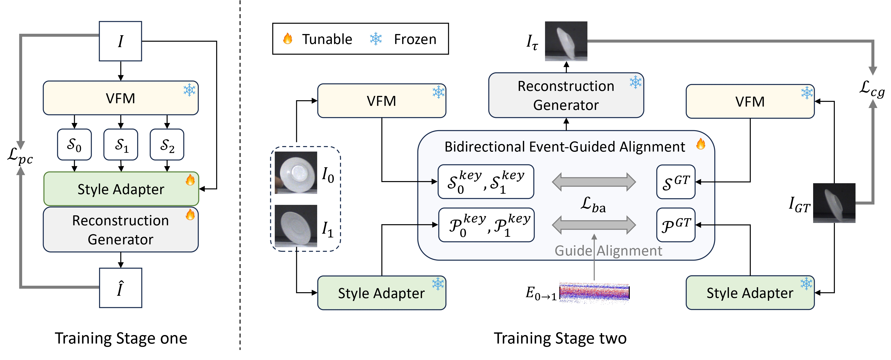

# EPA: Boosting Event-based Video Frame Interpolation with Perceptually Aligned Learning

**In NIPS 2025.**

This repository represents the official PyTorch implementation for the paper "EPA: Boosting Event-based Video Frame Interpolation with Perceptually Aligned Learning", also denoted as "EPA".

[](https://nips.cc/)
[](https://opensource.org/licenses/MIT)

We present EPA, a novel framework designed to address a critical challenge in Event-based Video Frame Interpolation (E-VFI): performance degradation in extreme scenarios with high-speed motion and severe keyframe degradation (e.g., blur, noise). The core innovation of EPA is a paradigm shift from conventional pixel-level supervision to learning within a degradation-insensitive, semantic-perceptual feature space.

*   **Perceptually Aligned Learning Paradigm**: By operating in a semantic-perceptual feature space, EPA is significantly more robust to real-world degradations like motion blur and sensor noise, leading to superior generalization.
*   **Bidirectional Event-Guided Alignment (BEGA) Module**: We propose a novel and efficient module that leverages the high temporal resolution of event streams to accurately align and fuse semantic features from keyframes.
*   **State-of-the-Art Performance**: EPA achieves leading performance on multiple synthetic and real-world benchmarks (e.g., GOPRO, Vimeo90k, HS-ERGB), especially in terms of perceptual quality metrics like LPIPS and DISTS.


<p align="center">
  
</p>


## 🛠️ Installation

### Setup Environment
We highly recommend using `conda` to create an isolated environment.

```bash
# 1. Clone the repository
git clone https://github.com/your-username/EPA.git
cd EPA

# 2. Create and activate the conda environment
conda create -n epa python=3.10
conda activate epa

# 3. Install dependencies
pip install -r requirements.txt
```
<!-- TODO: Ensure you have a `requirements.txt` file in your project listing all necessary Python packages. -->


## 💾 Datasets and Pre-trained Models

### 1. Datasets
Please download the required datasets and organize them as follows.
1. Vimeo90k dataset
2. GOPRO dataset
3. HSERGB dataset
4. [BSERGB dataset](https://github.com/uzh-rpg/timelens-pp/?tab=readme-ov-file)
5. [EventAid-F dataset](https://sites.google.com/view/EventAid-benchmark)

### 2. Pre-trained Models
It will be available soon.

[//]: # (Download our pre-trained models from the link below and place them in the `checkpoints` directory.)

[//]: # ()
[//]: # ([**Download All Pre-trained Models &#40;Google Drive / Hugging Face&#41;**]&#40;https://your-download-link.com&#41;)

[//]: # (<!-- TODO: Upload your model weights and replace the link above. -->)

[//]: # ()
[//]: # (After downloading, extract the files and place them under `./checkpoints/`.)


## ⚡️ Inference

To run inference on your own frame sequence, please refer to the interpolation.py file.


## 📜 Citation
If you find our work useful for your research, please consider citing our paper:
```bibtex
@inproceedings{liu2025epa,
  title={{EPA}: Boosting Event-based Video Frame Interpolation with Perceptually Aligned Learning},
  author={Liu, Yuhan and Fu, Linghui and Yang, Zhen and Chen, Hao and Li, Youfu and Deng, Yongjian},
  booktitle={Advances in Neural Information Processing Systems (NeurIPS)},
  year={2025}
}
```

## 🙏 Acknowledgements
Our implementation builds upon several excellent open-source projects. We are grateful for their contributions to the community.
*   [DINO](https://github.com/facebookresearch/dino)
*   [PerVFI](https://github.com/mulns/PerVFI)
*   [FloLPIPS](https://github.com/danier97/flolpips)

## 📄 License
This project is licensed under the [MIT License](LICENSE).
